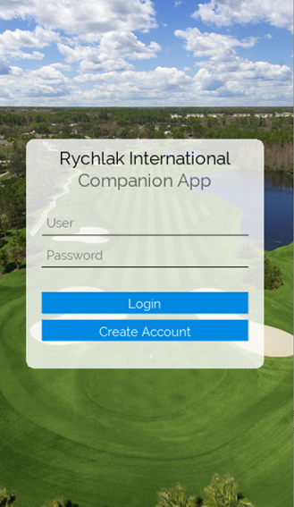
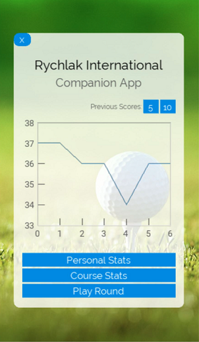
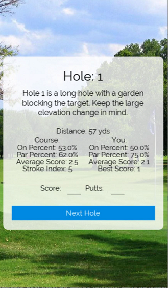
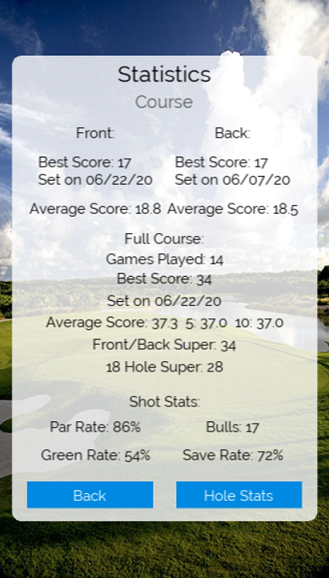

May 2020 | [Github Repo](https://github.com/ryanrych/Golf-Score-App)

An app written for my senior engineering class in high school. The goal is for golfers to have an easy 
way to track their progress by giving them as many data points as possible. This is done by giving information 
such as best score, average score, par rate, green rate, and more for each hole and for the entire course. 
Along with personal data, it keeps the same data points for all of the golfers on the same course combined to 
give users a feel for how they stack up to others. I've also added a leaderboard 
with several records that anybody can set, this adds a bit of competition for those who want to partake.  
This was written in Python using the Kivy module for the front end.

  

  

  
